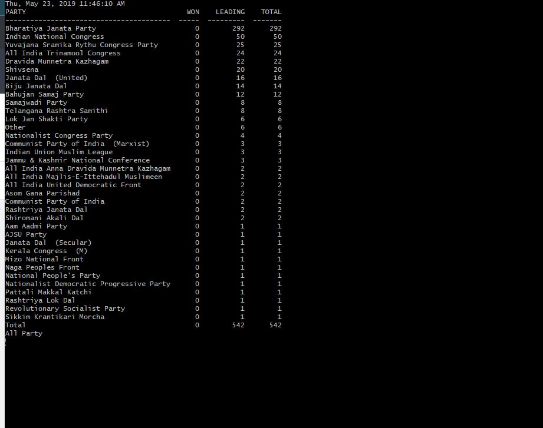

# Lok Sabha Result parser

This script can parse results from the election result page at results.eci.gov.in and print result as a table.

 ### Run with "python election.py"
 
For linux users: run with "watch 'python election.py'" to get an auto refresh result page.

Windows users can run "./watch.sh 'python election.py'" to achieve the same result.

# Screenshot:
